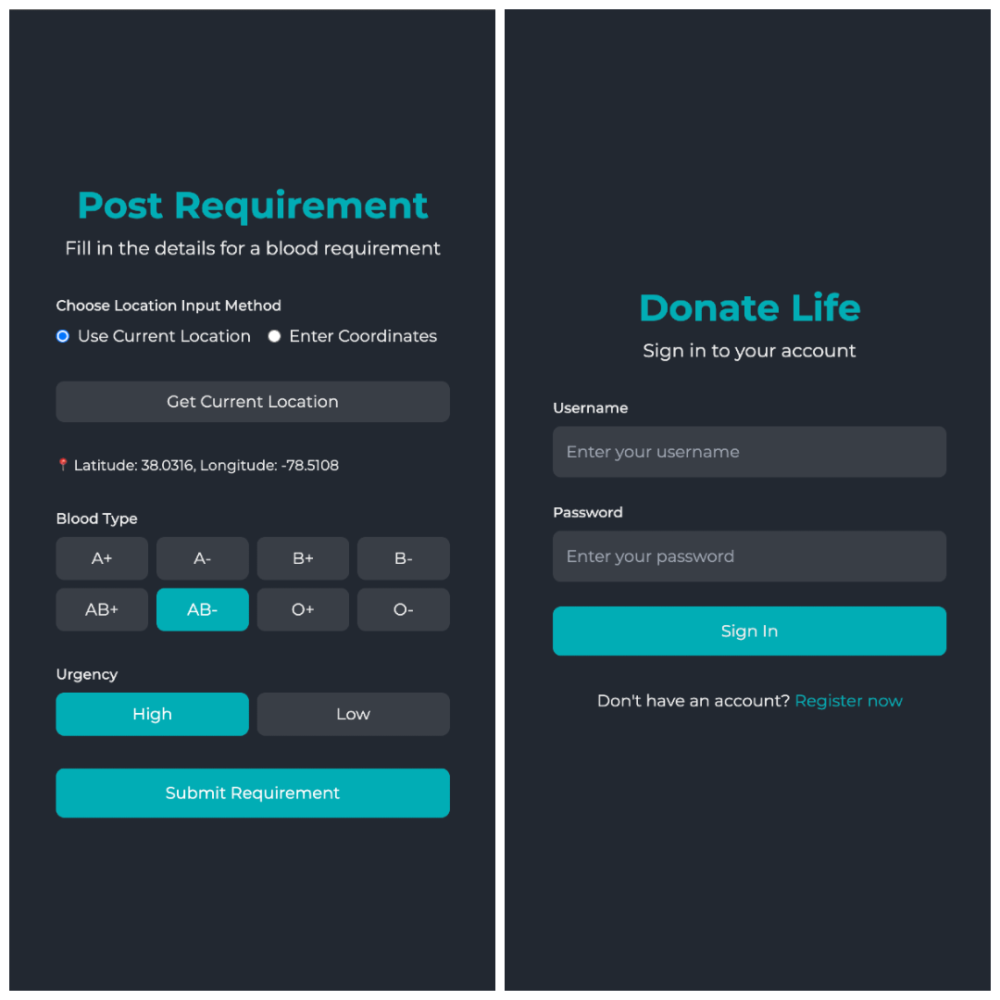
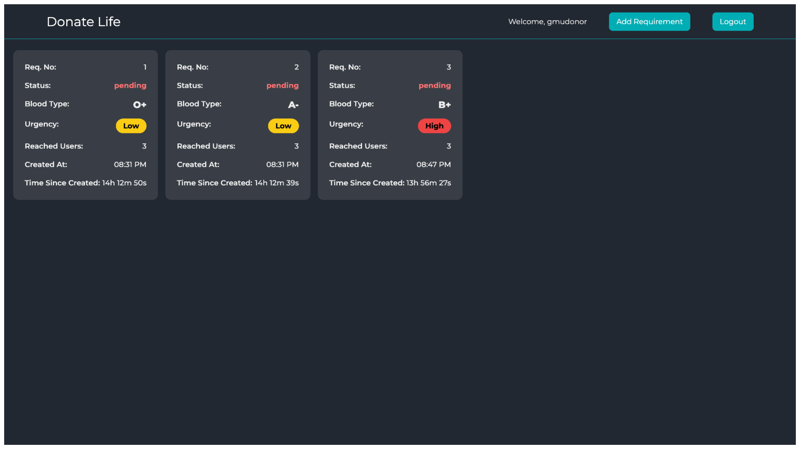
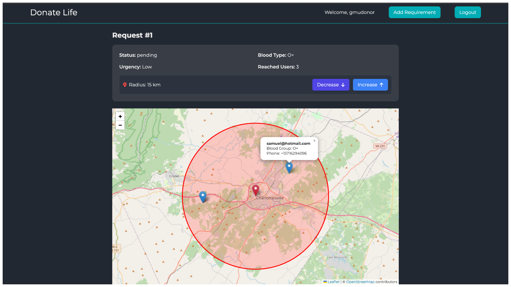
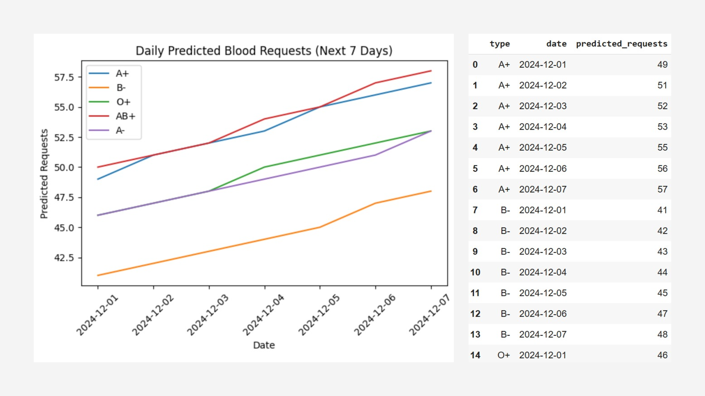
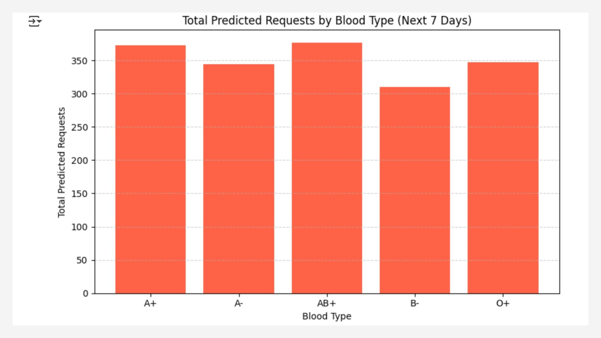

# Donate Life
 

## Overview  
**Donate Life** is a platform that connects blood banks with donors in real time during emergencies. Blood banks can post urgent blood requests, and nearby donors receive SMS and email notifications. If no donors respond, the search radius expands until a match is found. A machine learning model also predicts future blood demand, helping blood banks proactively manage inventory.

## Features  
✅ Real-time blood request notifications via SMS and email  
✅ Geospatial search to find nearby donors dynamically  
✅ Machine learning model to predict blood demand trends  
✅ Interactive map using Leaflet for donor visualization  
✅ Secure authentication and user management  
✅ Responsive and intuitive UI  

## Tech Stack  
- **Frontend:** React.js, Leaflet.js, Tailwind CSS  
- **Backend:** Node.js, Express.js, MongoDB  
- **Database:** MongoDB with Geospatial Indexing (`geoNear`)  
- **Notifications:** Textbelt (SMS), AWS SES (Email)  
- **Machine Learning:** Linear Regression for demand prediction  
- **Cloud & Hosting:** AWS Lambda, EC2, S3  

## Setup Instructions  

### Prerequisites  
- Node.js (v18+)  
- MongoDB installed or a cloud instance (e.g., MongoDB Atlas)  
- `.env` file with API keys for Textbelt, AWS SES, and MongoDB  

### Installation  

```bash
# Clone the repository
git clone https://github.com/Baalavignesh/donatelife
git clone https://github.com/Baalavignesh/donatelife_backend
cd donatelife # Or "donatelife-backend"

# Install dependencies
npm install

# Start the development server
node index.js  # or npm run dev for Vite-based frontend
```
## Screenshots  
### Homepage  
 
 
  

### Machine Learning Predictions 
 
 

---

## Contributors  
👤 [Baalavignesh Arunachalam](https://github.com/Baalavignesh) <br>  
👤 [Samuel Archit Sowpati](https://github.com/samuelsowpati) <br>  
👤 [Shree Pallavi Vegesana](https://github.com/Icebear242000) <br>  
👤 [Anushka Iytha](https://github.com/anuiytha) <br>  
 

---

## Links  
🔗 **Frontend Repo:** [GitHub](https://github.com/Baalavignesh/donatelife)  
🔗 **Backend Repo:** [GitHub](https://github.com/Baalavignesh/donatelife_backend)  
🔗 **Machine Learning :** [Notebook](https://github.com/Baalavignesh/donatelife_backend/blob/main/LinearRegressionBloodBank.pdf)  
